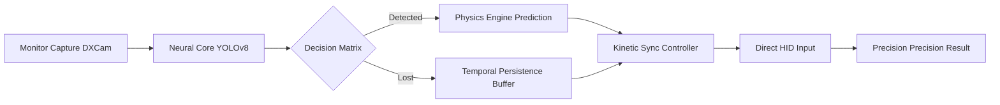

<div align="center">
  
  
  <p align="center">
    
    
    
  </p>

  **Advanced Real-Time Computer Vision & Kinetic Input Synchronization**
  
  *A high-performance demonstration of low-latency object detection and relative input control in dynamic 3D environments.*
</div>

---

## 🛰️ Executive Summary
**Axion Engine** is a cutting-edge technical showcase of real-time Computer Vision (CV) integrated with high-precision HID input emulation. Leveraging the **Ultralytics YOLOv8** architecture and **NVIDIA’s Blackwell Tensor Cores**, it achieves sub-5ms inference times, providing a seamless "Neural Edge" assist experience.

> [!IMPORTANT]
> This project is developed for **Research, Accessibility, and Educational purposes**. It demonstrates the bridge between AI perception and hardware interaction.

---

## 🛠️ Technology Stack
| Layer | Technology | Rationale |
| --- | --- | --- |
| **Inference Engine** | `YOLOv8 (Ultralytics)` | Real-time SOTA object detection accuracy. |
| **Compute Core** | `PyTorch / CUDA 12.8` | Optimized for FP16 Mixed Precision on RTX 50-series GPUs. |
| **Capture Layer** | `DXCam` | High-speed (240Hz+) screen buffering via Desktop Duplication API. |
| **Input Sync** | `Kinetic Relative Deltas` | Direct HID move-event calls bypassing system cursor lock-states. |
| **Interface** | `CustomTkinter` | Modern, hardware-accelerated UI with "Liquid Glass" aesthetics. |

---

## 🧠 Core Technical Pillars

### 1. Kinetic Sync Synchronization
Traditional input logic fails in 3D environments due to center-locked cursors. Axion v0.8.7 introduces **Relative Delta Logic**, calculating precise physical mouse offsets from the screen center, ensuring zero-conflict assistance in high-stakes environments.

### 2. Temporal Stability Engine
To handle noisy detection signals, Axion implements a **3-frame persistence buffer**. This prevents "flicker" and ensures a stable mechanical lock even when objects are partially occluded or moving at high velocities.

### 3. Asynchronous Multi-Threading
The Vision Core runs on a dedicated high-priority thread, strictly decoupled from the UI/Overlay. This allows the HUD to maintain **144Hz+ rendering stability** while the AI processes frames at maximum speed.

---

## 📐 System Architecture


---

## 🚀 Professional Installation

### Prerequisites
- **Python 3.11.9** (Mandatory for dependency stability)
- **NVIDIA Driver 570+** (Required for CUDA 12.8 support)

### Setup
1. **Clone & Environment**:
   ```bash
   git clone https://github.com/henrkk123/AI-Aimbot-.git
   cd AI-Aimbot-
   ```
2. **Automated Provisioning**:
   Execute `UPDATE.bat` to automatically build the virtual environment and install optimized torch binaries for your specific GPU architecture.
3. **Initialize**:
   Run `START.bat` to launch the Axion Core.

---

## 💎 Premium UI Philosophy
Designed with the **"Premium Simplicity"** mantra, the interface minimizes technical jargon while providing deep diagnostic visibility. Every element is tuned to the "Axion Green" aesthetic—clean, professional, and high-performance.

---

<div align="center">
  
  <br>
  <sub><b>Built by engineers, for the elite.</b> | © 2026 AXION CORP.</sub>
</div>
